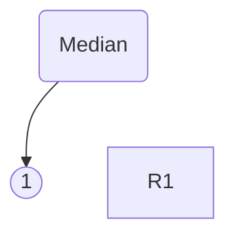
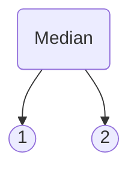
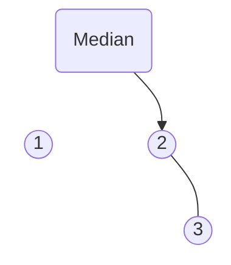
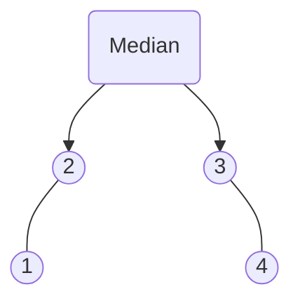
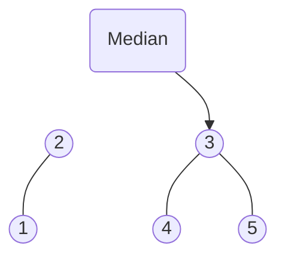


use medianheap::{Median, MedianHeap};

let mut heap = MedianHeap::new();

assert_eq!(heap.median(), None);

heap.push(1);
assert_eq!(heap.median(), Some(Median::Single(&1)));

heap.push(3);
assert_eq!(heap.median(), Some(Median::Pair(&1, &3)));


As part of my oil tank level monitoring project, I needed to smooth sensor readings from an ultrasonic distance sensor. One way that works well for this purpose is a median heap which keeps track of the running median. No Rust crate existed at the time that provided this functionality, so I developed this crate myself. It has also since been used to smooth sensor readings for monitoring water levels in the cisterns in my garden.

<!--more-->

The median heap consists of a left max-heap and right min-heap.

Let's start by inserting the first element, 1. If one heap is larger than the other, the median is the top of the larger heap, in this case the left max heap.

Now, after inserting the next number, 2, the length of both heaps is equal, so the median is a pair of the left and right values.

After inserting 3, the right heap is bigger, so the median is the minimum value of the right heap.

After inserting another value, 4, both heaps have the same size again, so the median consists of a pair of values again:

Insert another value, 5, and the median is again the minimum of the right heap.

